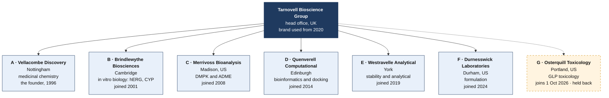
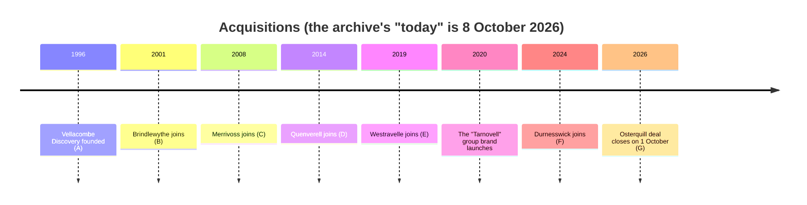
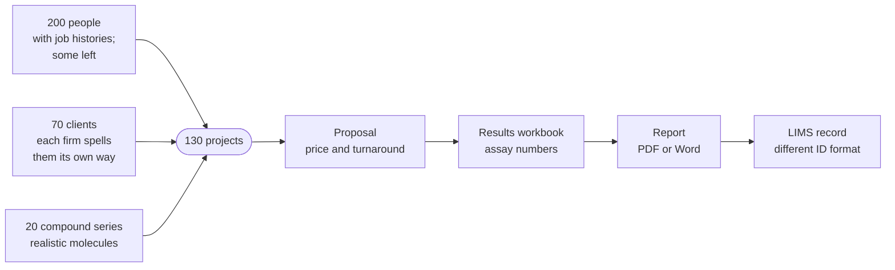
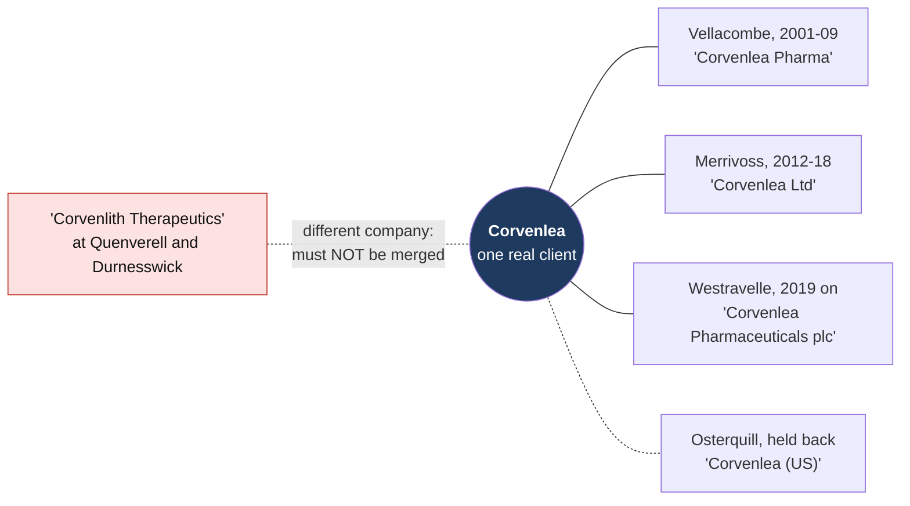
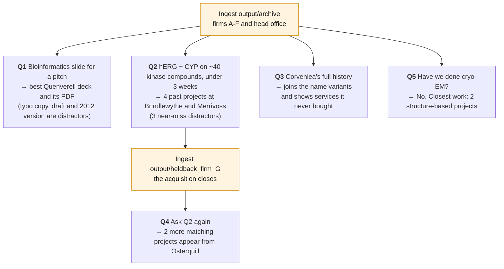

# portco-mock-dataset

A fictional document archive for demoing AI Brain on a buy-and-build portfolio company (DEV-1369, DEV-1370). Everything in it is invented: the firms, people, clients, compounds, projects and results.

- **Ready to ingest:** `tarnovell_archive.zip` (306 files) first, then `tarnovell_firm_G_heldback.zip` (34 files, firm G) for the acquisition step. Unzipped sources: `output/archive/` and `output/heldback_firm_G/`.
- **Answer key:** `output/golden_set.json`. Don't ingest it.
- **How it was made and how to regenerate it:** [`docs/datasheet.md`](docs/datasheet.md).

## The fake world

**Tarnovell Bioscience Group** is a contract research group built over 30 years by buying small specialist labs. Each lab kept its own shared drive, file-naming habits and client names, so the group's knowledge is scattered across seven legacy archives. Finding it is the problem AI Brain solves in the demo.

### The group



### How it grew



Before 2020 the group was simply "the Vellacombe group". Older files keep their original firm's look, names and date formats.

### What lives in it



Around the projects sit capability decks, SOPs, trackers, price lists, memos, board packs, scanned signed reports, legacy .ppt/.xls/.doc files and junk (empty templates, "Copy of" files, leavers' old laptops). Assay numbers come from models trained on public ADMET data, so they look real to a scientist.

### One client, many names

The key client, **Corvenlea**, appears under a different name at each firm that worked with it. A lookalike company is the trap.



The head office's client identity bridge and white-space matrix name these variants together, which is what lets AI Brain join them up.

## The demo



Each question has a planted answer. `output/golden_set.json` gives the expected files and the page or slide each answer is on.

### Packaging for ingestion

File dates are part of the realism and `zip` keeps them. After cloning, run `uv run mockgen export` once to restore the dates (git doesn't store them). Then:

```bash
cd output/archive && zip -r -X ~/Desktop/tarnovell_archive.zip . -x '.DS_Store' '*/.DS_Store'
cd ../heldback_firm_G && zip -r -X ~/Desktop/tarnovell_firm_G_heldback.zip . -x '.DS_Store' '*/.DS_Store'
```

All names were screened so they don't clash with real companies or people.
